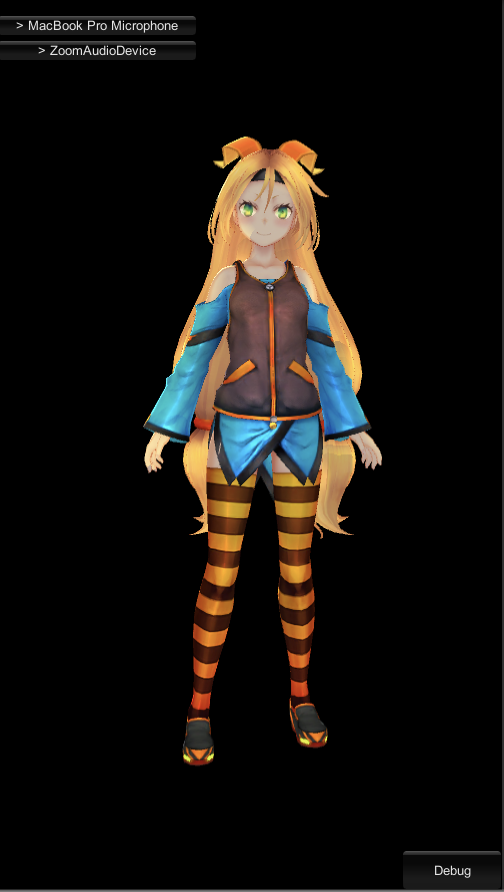

# HoloGirl

Simple app that allows to record audio from device's mic and control character behavior.
The external API server is used to analyze the voice and return response.

You could find examples of server requests and stubs in `test` folder.

Requirements:
* Unity 2018
* To run tests you will need `curl`, `afplay`, `docker-compose`
